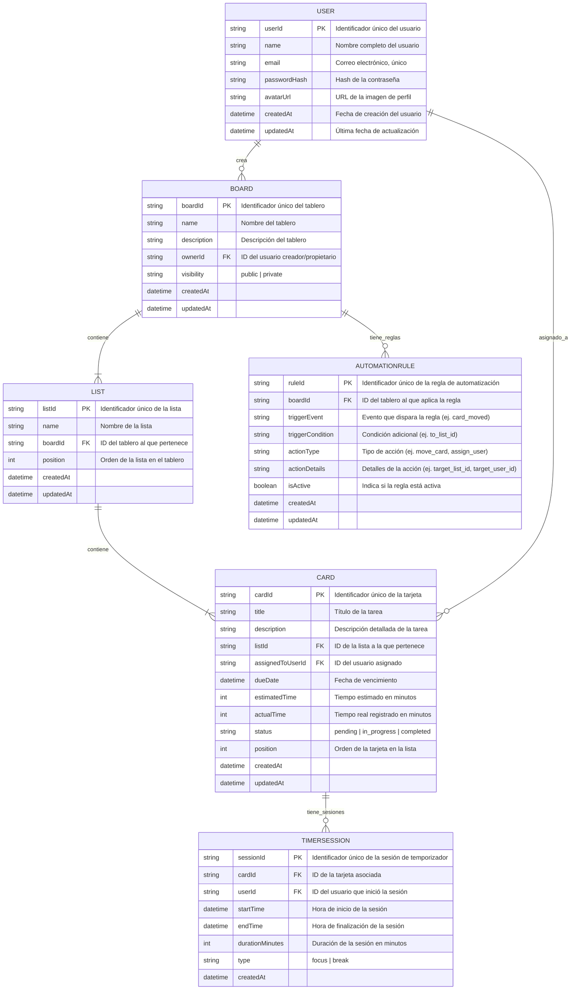

# Esencial Flow: Product Requirements Document (PRD) - v0.1

*   **Status:** Draft
*   **Version:** 0.1
*   **Last Updated:** 2025-07-25
*   **Owner:** [Product Manager Name]

---

## Índice

1.  **Resumen Ejecutivo**
2.  **Personas & Jobs-to-be-Done**
3.  **Problemas / Pains / Casos de Uso Prioritarios**
4.  **Pilares & Especificaciones Funcionales**
5.  **User Journeys Clave**
6.  **Arquitectura de Información & Modelo de Datos (detallado)**
7.  **Integraciones & APIs (alto nivel)**
8.  **Requisitos No Funcionales (NFRs)**
9.  **Analítica & Métricas de Éxito**
10. **Monetización**
11. **Roadmap y Priorización (MVP → V1 → V2)**
12. **Riesgos, Supuestos y Dependencias**
13. **Definition of Ready / Definition of Done**
14. **Checklist de Handoff a Diseño & Ingeniería**
15. **Glosario**
16. **Preguntas Abiertas & Decisiones Pendientes**
17. **Anexos**

---

## 1. Resumen Ejecutivo

Esencial Flow es una aplicación de productividad que fusiona la gestión visual de proyectos en equipo con herramientas de enfoque profundo para el trabajo individual. A diferencia de las soluciones existentes que se centran en uno de estos dos aspectos, Esencial Flow integra ambos para ofrecer una experiencia unificada que mejora tanto la colaboración como la productividad personal. La plataforma está diseñada para equipos de hasta 50 personas y freelancers, con un enfoque en la simplicidad, la flexibilidad y la potencia.

## 2. Personas & Jobs-to-be-Done

### 2.1. Gerente de Proyecto / Líder (Paula)

*   **Rol:** Gerente de Producto en una startup de tecnología (equipo de 15).
*   **Necesidades (Jobs-to-be-Done):**
    *   Tener una visión clara y en tiempo real del estado de todos los proyectos.
    *   Identificar cuellos de botella y riesgos antes de que se conviertan en problemas.
    *   Asegurar que el equipo esté trabajando en las prioridades correctas.
    *   Comunicar el progreso al liderazgo de manera eficiente.
    *   Facilitar la colaboración y reducir la fricción en los handoffs.
*   **Pains:**
    *   "Pierdo demasiado tiempo pidiendo actualizaciones de estado en Slack."
    *   "Las herramientas actuales son o demasiado simples (Trello) o demasiado complejas y caras (Jira)."
    *   "No tengo una forma fácil de ver la carga de trabajo de cada persona."
    *   "Las prioridades cambian y es difícil asegurar que todos estén alineados."

### 2.2. Miembro de Equipo / Ejecutante (David)

*   **Rol:** Desarrollador Senior en el equipo de Paula.
*   **Necesidades (Jobs-to-be-Done):**
    *   Saber exactamente en qué tiene que trabajar cada día.
    *   Entender el impacto de su trabajo en el proyecto global.
    *   Concentrarse en una tarea a la vez sin distracciones.
    *   Registrar su tiempo de forma sencilla para mejorar estimaciones futuras.
    *   Colaborar eficazmente con diseñadores y otros desarrolladores.
*   **Pains:**
    *   "Tengo tareas asignadas en Trello, issues en GitHub, y conversaciones en Slack. Es un caos."
    *   "Las notificaciones constantes me sacan de mi 'zona de flujo'."
    *   "A veces no estoy seguro si estoy trabajando en lo más importante."
    *   "Estimar el tiempo es difícil y a menudo me equivoco."

### 2.3. Freelancer (Ana)

*   **Rol:** Diseñadora UX/UI que trabaja con múltiples clientes.
*   **Necesidades (Jobs-to-be-Done):**
    *   Gestionar proyectos de varios clientes en un solo lugar.
    *   Comunicar el progreso y entregar resultados a los clientes de forma profesional.
    *   Registrar el tiempo dedicado a cada cliente para la facturación.
    *   Mantener un equilibrio entre el trabajo colaborativo con clientes y el trabajo profundo e individual.
*   **Pains:**
    *   "Cada cliente quiere usar una herramienta diferente, lo que me obliga a saltar entre Asana, Trello, y hojas de cálculo."
    *   "Necesito una forma de demostrar el valor de mi trabajo y justificar mis horas."
    *   "Es difícil mantenerme enfocada cuando tengo múltiples proyectos compitiendo por mi atención."

## 3. Problemas / Pains / Casos de Uso Prioritarios

### 3.1. Problema #1: Fragmentación de Herramientas

*   **Descripción:** Los equipos y freelancers utilizan un mosaico de herramientas para la gestión de proyectos, la comunicación y el seguimiento del tiempo. Esto conduce a la pérdida de información, la duplicación de esfuerzos y una visión incompleta del progreso.
*   **Caso de Uso:** Un equipo utiliza Trello para el tablero Kanban, Slack para la comunicación, y una herramienta de terceros como Toggl para el seguimiento del tiempo. La información clave sobre una tarea está dispersa en tres lugares diferentes.

### 3.2. Problema #2: Tensión entre Colaboración y Enfoque

*   **Descripción:** Las herramientas de gestión de proyectos están optimizadas para la colaboración en equipo, pero a menudo a expensas de la productividad individual. Las notificaciones constantes y la presión de estar "siempre activo" dificultan el trabajo profundo y concentrado.
*   **Caso de Uso:** Un desarrollador intenta trabajar en una tarea compleja pero es interrumpido constantemente por notificaciones de Slack y comentarios en Trello, lo que le impide entrar en un estado de flujo.

### 3.3. Problema #3: Falta de Visibilidad y Predictibilidad

*   **Descripción:** Los gerentes de proyecto carecen de herramientas efectivas para visualizar la carga de trabajo del equipo, identificar cuellos de botella y predecir con precisión las fechas de finalización. Las estimaciones de tiempo suelen ser conjeturas sin base en datos históricos.
*   **Caso de Uso:** Un gerente de proyecto se da cuenta demasiado tarde de que una tarea crítica está bloqueada y no tiene forma de saber cuánto tiempo ha estado atascada o cuál es el impacto en la fecha de lanzamiento.

### 3.4. Problema #4: Dificultad en la Gestión de Múltiples Proyectos

*   **Descripción:** Tanto los freelancers como los gerentes que supervisan múltiples proyectos luchan por mantener una visión general coherente sin sentirse abrumados. Cambiar de contexto entre diferentes tableros o espacios de trabajo es ineficiente.
*   **Caso de Uso:** Una freelancer pierde una fecha límite importante porque estaba oculta en un tablero de un cliente que no había revisado en varios días.

## 4. Pilares & Especificaciones Funcionales

### 4.1. Pilar 1: Motor de Colaboración Visual

#### 4.1.1. Kanban Boards

*   **Objetivo:** Proporcionar una forma visual e intuitiva de gestionar flujos de trabajo y el progreso de las tareas.
*   **Usuario:** Todos los usuarios.
*   **Flujo:**
    1.  Los usuarios pueden crear tableros para proyectos o equipos.
    2.  Dentro de un tablero, los usuarios pueden crear listas (p. ej., "Backlog", "En progreso", "Hecho").
    3.  Los usuarios pueden crear tarjetas dentro de las listas para representar tareas.
    4.  Las tarjetas se pueden arrastrar y soltar entre listas para indicar el progreso.
*   **Reglas:**
    *   Los tableros pueden ser públicos (visibles para todo el equipo) o privados (solo para miembros invitados).
    *   Los usuarios pueden personalizar los nombres y el orden de las listas.
*   **Métricas de Éxito:**
    *   Número de tableros creados.
    *   Número de tarjetas creadas y movidas.
    *   Tiempo promedio que una tarjeta pasa en cada lista.

#### 4.1.2. Vistas Nativas Múltiples

*   **Objetivo:** Ofrecer diferentes perspectivas de los datos del proyecto para adaptarse a las necesidades de los distintos usuarios.
*   **Usuario:** Todos los usuarios.
*   **Flujo:**
    *   **Kanban:** Vista predeterminada con listas y tarjetas.
    *   **Calendario:** Ver las tarjetas con fechas de vencimiento en una vista de calendario mensual o semanal.
    *   **Cronograma (Gantt Ligero):** Visualizar las dependencias de las tareas y los plazos del proyecto en una línea de tiempo.
    *   **Lista:** Vista compacta y densa de las tareas, ideal para revisiones rápidas.
    *   **Portafolio / Panel Maestro:** Agregar métricas y tarjetas de múltiples tableros en una única vista consolidada.
*   **Reglas:**
    *   Los usuarios pueden cambiar fácilmente entre las diferentes vistas.
    *   Los filtros aplicados en una vista se mantienen al cambiar a otra.
*   **Métricas de Éxito:**
    *   Frecuencia de uso de cada vista.
    *   Tiempo dedicado a cada vista.

#### 4.1.3. Colaboración Robusta

*   **Objetivo:** Facilitar la comunicación y la colaboración fluidas dentro del equipo.
*   **Usuario:** Todos los usuarios.
*   **Flujo:**
    *   **Asignaciones:** Asignar tarjetas a uno o más miembros del equipo.
    *   **Fechas de Vencimiento:** Establecer fechas de vencimiento para las tarjetas.
    *   **@menciones:** Mencionar a otros usuarios en los comentarios para notificarles.
    *   **Checklists:** Crear listas de verificación dentro de las tarjetas para desglosar las tareas.
    *   **Adjuntos:** Adjuntar archivos desde el ordenador o desde servicios en la nube (Google Drive, Dropbox).
*   **Reglas:**
    *   Las notificaciones son configurables para evitar la sobrecarga.
*   **Métricas de Éxito:**
    *   Número de comentarios y @menciones.
    *   Porcentaje de tarjetas con asignaciones y fechas de vencimiento.

#### 4.1.4. Automatización sin Código — “FlowBot”

*   **Objetivo:** Automatizar tareas repetitivas y flujos de trabajo para ahorrar tiempo y reducir errores.
*   **Usuario:** Principalmente Gerentes de Proyecto, pero disponible para todos.
*   **Flujo:**
    *   Los usuarios pueden crear reglas "si/entonces" utilizando un editor visual.
    *   Los disparadores pueden basarse en eventos (p. ej., mover una tarjeta a una lista) o en el tiempo (p. ej., todos los lunes a las 9 a.m.).
    *   Las acciones pueden incluir mover tarjetas, asignar usuarios, añadir etiquetas, etc.
*   **Reglas:**
    *   Se proporcionará una biblioteca de recetas de automatización predefinidas.
*   **Métricas de Éxito:**
    *   Número de reglas de automatización creadas.
    *   Número de acciones ejecutadas por FlowBot.

### 4.2. Pilar 2: Motor de Enfoque Individual

#### 4.2.1. Gestión de Tiempo por Tarjeta

*   **Objetivo:** Permitir a los usuarios estimar y registrar el tiempo dedicado a cada tarea.
*   **Usuario:** Todos los usuarios.
*   **Flujo:**
    *   **Estimación de Tiempo:** Campo nativo y obligatorio en cada tarjeta para estimar el tiempo necesario.
    *   **Temporizador Nativo:** Un temporizador integrado para registrar el tiempo real dedicado a una tarea.
*   **Reglas:**
    *   El temporizador se puede iniciar, pausar y detener desde la tarjeta.
*   **Métricas de Éxito:**
    *   Precisión de las estimaciones de tiempo (comparación entre el tiempo estimado y el tiempo real registrado).

#### 4.2.2. Modo de Enfoque (“Focus Mode”)

*   **Objetivo:** Ayudar a los usuarios a concentrarse en una sola tarea sin distracciones.
*   **Usuario:** Todos los usuarios.
*   **Flujo:**
    *   Al iniciar el Modo de Enfoque en una tarjeta, se abre un panel flotante no intrusivo.
    *   El panel muestra la tarea actual, el tiempo restante y las subtareas.
    *   **Pomodoro Nativo:** Temporizador Pomodoro configurable (p. ej., 25/5, 50/10) integrado en el Modo de Enfoque.
*   **Reglas:**
    *   El Modo de Enfoque minimiza las notificaciones no relacionadas con la tarea actual.
*   **Métricas de Éxito:**
    *   Frecuencia y duración del uso del Modo de Enfoque.
    *   Tasa de finalización de las sesiones de Pomodoro.

#### 4.2.3. Mi Día / Bandeja Personal

*   **Objetivo:** Proporcionar una vista centralizada de las tareas que un usuario necesita realizar en el día actual.
*   **Usuario:** Todos los usuarios.
*   **Flujo:**
    *   Agrega automáticamente las tarjetas con fecha de vencimiento "hoy" de todos los tableros del usuario.
    *   Los usuarios pueden iniciar el Modo de Enfoque directamente desde esta vista.
*   **Reglas:**
    *   Los usuarios pueden añadir manualmente tareas a su vista "Mi Día".
*   **Métricas de Éxito:**
    *   Porcentaje de tareas completadas desde la vista "Mi Día".

#### 4.2.4. Elementos Motivacionales (Opt-in)

*   **Objetivo:** Aumentar la motivación y la satisfacción del usuario al completar tareas.
*   **Usuario:** Todos los usuarios (opcional).
*   **Flujo:**
    *   Al completar una tarea, se pueden activar sonidos satisfactorios, GIFs o micro-animaciones.
*   **Reglas:**
    *   Los usuarios pueden habilitar o deshabilitar estas funciones en la configuración.
*   **Métricas de Éxito:**
    *   Tasa de adopción de los elementos motivacionales.

### 4.3. Pilar 3: Plataforma & Ecosistema

#### 4.3.1. Mobile-first & Offline-first

*   **Objetivo:** Garantizar una experiencia de usuario fluida y funcional en dispositivos móviles, incluso sin conexión a Internet.
*   **Usuario:** Todos los usuarios de dispositivos móviles.
*   **Flujo:**
    *   La aplicación móvil será totalmente funcional sin conexión a Internet.
    *   Los cambios realizados sin conexión se sincronizarán automáticamente cuando se restablezca la conexión.
*   **Reglas:**
    *   Se definirá una estrategia clara para la resolución de conflictos (CRDTs, LWW, merges guiados).
*   **Métricas de Éxito:**
    *   Número de sesiones offline.
    *   Tasa de éxito de la sincronización de datos.

#### 4.3.2. Interfaz Limpia y Escalable

*   **Objetivo:** Proporcionar una interfaz de usuario intuitiva y fácil de usar que pueda manejar un gran número de proyectos sin generar desorden.
*   **Usuario:** Todos los usuarios.
*   **Flujo:**
    *   Diseño inspirado en la simplicidad y la claridad.
    *   La interfaz se adaptará a diferentes tamaños de pantalla y densidades de información.
*   **Reglas:**
    *   Se seguirán los principios de diseño de Material Design.
*   **Métricas de Éxito:**
    *   Puntuaciones de usabilidad y satisfacción del usuario.

#### 4.3.3. Integraciones Estratégicas Iniciales

*   **Objetivo:** Ampliar la funcionalidad de Esencial Flow mediante la integración con otras herramientas populares.
*   **Usuario:** Todos los usuarios.
*   **Flujo:**
    *   **Slack:** Recibir notificaciones y crear tareas desde Slack.
    *   **Google Workspace:** Sincronizar fechas de vencimiento con Google Calendar y adjuntar archivos desde Google Drive.
    *   **GitHub:** Vincular commits y pull requests a las tarjetas.
    *   **Notion:** Incrustar tableros de Esencial Flow en páginas de Notion.
    *   **Zapier:** Conectar Esencial Flow con miles de otras aplicaciones a través de Zapier.
*   **Reglas:**
    *   Las integraciones serán fáciles de configurar y gestionar.
*   **Métricas de Éxito:**
    *   Número de integraciones activas.
    *   Frecuencia de uso de cada integración.

#### 4.3.4. Analíticas y Reportes Nativos

*   **Objetivo:** Proporcionar a los usuarios información valiosa sobre su productividad y el rendimiento de sus proyectos.
*   **Usuario:** Gerentes de Proyecto y usuarios individuales.
*   **Flujo:**
    *   **Equipos:**
        *   **Burndown Chart:** Visualizar el progreso del trabajo a lo largo del tiempo.
        *   **Velocity Chart:** Medir la cantidad de trabajo que un equipo puede completar en un período de tiempo determinado.
        *   **Cuellos de Botella:** Identificar las etapas del flujo de trabajo donde las tareas se estancan.
    *   **Individuos:**
        *   **Precisión de Estimaciones:** Comparar el tiempo estimado con el tiempo real registrado.
        *   **Horas más Productivas:** Identificar los momentos del día en que el usuario es más productivo.
        *   **Patrones de Foco:** Analizar la duración y la frecuencia de las sesiones de enfoque.
*   **Reglas:**
    *   Los informes serán personalizables y exportables.
*   **Métricas de Éxito:**
    *   Frecuencia de visualización de los informes.
    *   Número de informes personalizados creados.

## 5. User Journeys Clave

### 5.1. Planificación y Asignación de Tareas

1.  **Contexto:** Paula, la Gerente de Producto, necesita planificar el próximo lanzamiento de un producto, "Q4 Launch".
2.  **Acción:** Paula crea un nuevo tablero en Esencial Flow llamado "Q4 Launch".
3.  **Acción:** Dentro del tablero, crea las siguientes listas: "Backlog", "Diseño", "Desarrollo", "Pruebas", y "Lanzado".
4.  **Acción:** Paula crea una nueva tarjeta en la lista "Backlog" titulada "Diseñar nueva página de inicio".
5.  **Acción:** Asigna la tarjeta a Ana, la diseñadora, y establece una fecha de vencimiento para el próximo martes.
6.  **Acción:** Paula añade una estimación de 8 horas a la tarjeta.

### 5.2. Ejecución y Enfoque Individual

1.  **Contexto:** Ana, la diseñadora, comienza su jornada laboral y quiere saber en qué debe trabajar.
2.  **Acción:** Ana abre Esencial Flow y va a su vista personalizada "Mi Día".
3.  **Acción:** Ve la tarjeta "Diseñar nueva página de inicio" en la parte superior de su lista de tareas para hoy.
4.  **Acción:** Hace clic en el botón "Iniciar Foco" en la tarjeta.
5.  **Acción:** Se inicia un temporizador Pomodoro de 50 minutos y aparece un panel flotante no intrusivo en su pantalla.
6.  **Acción:** Ana trabaja en el diseño de la página de inicio. El temporizador registra su tiempo de trabajo.
7.  **Acción:** Cuando el temporizador de 50 minutos termina, recibe una notificación para tomar un descanso de 10 minutos.
8.  **Acción:** Después de su descanso, Ana reanuda el trabajo en la tarea.

### 5.3. Seguimiento y Colaboración

1.  **Contexto:** Paula quiere comprobar el progreso del proyecto "Q4 Launch".
2.  **Acción:** Paula abre la vista de "Portafolio / Panel Maestro" en Esencial Flow.
3.  **Acción:** Ve que se han registrado 50 minutos de trabajo en la tarjeta "Diseñar nueva página de inicio".
4.  **Acción:** Cuando Ana completa el diseño, arrastra la tarjeta de la lista "Diseño" a la lista "Desarrollo".
5.  **Acción:** Paula recibe una notificación de que la tarjeta ha sido movida.
6.  **Acción:** Paula abre la tarjeta, revisa el diseño adjunto y deja un comentario para David, el desarrollador, con la @mención "@David, el diseño está listo para que empieces a trabajar en él".
7.  **Acción:** David recibe una notificación y puede empezar a trabajar en la implementación.

## 6. Arquitectura de Información & Modelo de Datos (detallado)

### 6.1. Stack Tecnológico Propuesto

*   **Frontend (Web):** React con TypeScript.
    *   **Justificación:** Amplia comunidad, ecosistema maduro, componentes reutilizables, excelente para SPAs (Single Page Applications) interactivas. TypeScript mejora la mantenibilidad y reduce errores.
*   **Frontend (Móvil):** React Native.
    *   **Justificación:** Permite compartir gran parte del código base con la aplicación web, acelerando el desarrollo y manteniendo la consistencia de la UI/UX en iOS y Android.
*   **Backend (API):** Node.js con Express.js (TypeScript) o Python con FastAPI.
    *   **Justificación:**
        *   **Node.js/Express.js:** Ideal para aplicaciones en tiempo real y con muchas operaciones de I/O, lo que es relevante para la sincronización y notificaciones. Permite un stack JavaScript completo (frontend y backend).
        *   **Python/FastAPI:** Excelente rendimiento, tipado estático (con Pydantic), fácil de aprender y usar, ideal para construir APIs robustas y rápidas. Gran ecosistema para analíticas y ML si se expande en el futuro.
        *   **Decisión Pendiente:** La elección final dependerá de la experiencia del equipo de desarrollo y las necesidades específicas de rendimiento en tiempo real vs. la facilidad de desarrollo y el ecosistema de librerías.
*   **Base de Datos:** MongoDB (NoSQL Document Database).
    *   **Justificación:** Flexibilidad de esquema para la evolución rápida del producto, escalabilidad horizontal inherente, y buena integración con Node.js. Su naturaleza de documento se alinea bien con la estructura de datos de tableros, listas y tarjetas.
*   **Base de Datos (Offline/Local):** IndexedDB (para web) y Realm/SQLite (para móvil).
    *   **Justificación:** Permiten el almacenamiento persistente de datos en el cliente para la funcionalidad offline-first.
*   **Sincronización de Datos:** Implementación de CRDTs (Conflict-free Replicated Data Types) o un enfoque de "Last-Write Wins" (LWW) con marcas de tiempo.
    *   **Justificación:** Esencial para la funcionalidad offline-first y la colaboración en tiempo real, asegurando la consistencia de los datos a través de múltiples clientes y el servidor. Se priorizará la investigación y PoC (Proof of Concept) de CRDTs para una resolución de conflictos más robusta.
*   **Infraestructura Cloud:** AWS o Google Cloud Platform (GCP).
    *   **Justificación:** Proveedores líderes con servicios escalables para computación (EC2/Compute Engine, Lambda/Cloud Functions), bases de datos (DynamoDB/Firestore, RDS/Cloud SQL) y redes. La elección final dependerá de la experiencia del equipo y las ofertas de precios.

### 6.2. Modelo de Datos Detallado

A continuación, se detalla el modelo de datos con atributos clave y relaciones.

### 6.3. Consideraciones Adicionales

*   **Autenticación y Autorización:** Se utilizará JWT para la autenticación de usuarios. La autorización se basará en roles (RBAC) y permisos a nivel de recurso (ej. solo el propietario de un tablero puede eliminarlo).
*   **Notificaciones:** Se explorará el uso de WebSockets para notificaciones en tiempo real, complementado con servicios de notificación push para aplicaciones móviles.
*   **Búsqueda:** Se considerará la integración con un motor de búsqueda como Elasticsearch o Algolia para búsquedas rápidas y eficientes en tableros y tarjetas.

### 6.4. Estrategia de Despliegue y Operaciones

*   **CI/CD:** Se implementará un pipeline de Integración Continua/Despliegue Continuo (CI/CD) utilizando herramientas como GitHub Actions, GitLab CI/CD o Jenkins. Esto automatizará las pruebas, la construcción y el despliegue de la aplicación.
*   **Contenerización:** Las aplicaciones frontend y backend se empaquetarán en contenedores Docker para garantizar la portabilidad y la consistencia entre entornos.
*   **Orquestación:** Se utilizará Kubernetes (K8s) para la orquestación de contenedores, facilitando el escalado, la gestión de servicios y la alta disponibilidad.
*   **Monitoreo y Observabilidad:** Se implementarán herramientas de monitoreo (ej. Prometheus, Grafana) y logging centralizado (ej. ELK Stack o Grafana Loki) para supervisar el rendimiento de la aplicación, detectar anomalías y facilitar la resolución de problemas.
*   **Infraestructura como Código (IaC):** Se utilizarán herramientas como Terraform o Pulumi para definir y provisionar la infraestructura en la nube de manera programática, asegurando la reproducibilidad y la gestión de versiones.

### 6.5. Estrategia de Pruebas

*   **Pruebas Unitarias:** Se escribirán pruebas unitarias para componentes individuales y funciones críticas en el frontend y backend, utilizando frameworks como Jest (JavaScript) o Pytest (Python).
*   **Pruebas de Integración:** Se realizarán pruebas de integración para verificar la interacción entre diferentes módulos y servicios (ej. API del backend con la base de datos, frontend con la API).
*   **Pruebas End-to-End (E2E):** Se implementarán pruebas E2E para simular flujos de usuario completos, asegurando que la aplicación funcione correctamente desde la perspectiva del usuario final. Herramientas como Cypress o Playwright serán consideradas.
*   **Pruebas de Rendimiento:** Se realizarán pruebas de carga y estrés para evaluar el comportamiento de la aplicación bajo diferentes niveles de tráfico y carga de datos.
*   **Pruebas de Seguridad:** Se llevarán a cabo pruebas de seguridad (ej. escaneo de vulnerabilidades, pruebas de penetración) para identificar y mitigar posibles riesgos de seguridad.
*   **Pruebas de Usabilidad:** Se realizarán pruebas de usabilidad con usuarios reales para obtener feedback sobre la experiencia de usuario y la facilidad de uso de la aplicación.

## 7. Integraciones & APIs (alto nivel)

### 7.1. API Pública

Esencial Flow ofrecerá una API RESTful pública para permitir a los desarrolladores crear integraciones personalizadas y ampliar la funcionalidad de la plataforma. La API seguirá los principios de diseño de la API de Trello, con recursos para tableros, listas, tarjetas, usuarios, etc.

#### Endpoints Principales

*   `GET /boards`: Obtener todos los tableros de un usuario.
*   `GET /boards/{boardId}`: Obtener un tablero específico.
*   `POST /boards`: Crear un nuevo tablero.
*   `GET /boards/{boardId}/lists`: Obtener todas las listas de un tablero.
*   `GET /lists/{listId}/cards`: Obtener todas las tarjetas de una lista.
*   `POST /cards`: Crear una nueva tarjeta.
*   `PUT /cards/{cardId}`: Actualizar una tarjeta existente.

### 7.2. Webhooks

Se proporcionará un sistema de webhooks para notificar a las aplicaciones de terceros sobre los cambios en Esencial Flow en tiempo real. Los usuarios podrán configurar webhooks para eventos como:

*   Creación de una nueva tarjeta.
*   Movimiento de una tarjeta a una nueva lista.
*   Asignación de un usuario a una tarjeta.
*   Adición de un comentario a una tarjeta.

### 7.3. Permisos y Scopes

La API utilizará OAuth2 para la autenticación y autorización. Los desarrolladores podrán solicitar los siguientes scopes de permisos:

*   `read:boards`: Leer datos de tableros, listas y tarjetas.
*   `write:boards`: Crear y actualizar tableros, listas y tarjetas.
*   `read:user`: Leer información del perfil del usuario.
*   `webhook:manage`: Crear y gestionar webhooks.

## 8. Requisitos No Funcionales (NFRs)

### 8.1. Rendimiento

*   **Carga de la Página:** La aplicación debe cargarse en menos de 2 segundos en una conexión de banda ancha.
*   **Interacciones del Usuario:** Las interacciones del usuario (arrastrar y soltar, abrir tarjetas, etc.) deben sentirse instantáneas, con una latencia inferior a 100 ms.

### 8.2. Seguridad

*   **Autenticación:** Se utilizará JWT/OAuth2 para la autenticación de usuarios.
*   **Control de Acceso:** Se implementará un sistema de control de acceso basado en roles (RBAC) para gestionar los permisos de los usuarios.
*   **Cifrado:** Todos los datos se cifrarán en tránsito (TLS) y en reposo.
*   **Gestión de Secretos:** Las claves de API y otros secretos se gestionarán de forma segura utilizando un servicio como AWS Secrets Manager o HashiCorp Vault.

### 8.3. Escalabilidad

*   **Arquitectura:** La arquitectura estará diseñada para ser multi-tenant y escalable horizontalmente.
*   **Colas de Eventos:** Se utilizarán colas de eventos para procesar tareas asíncronas y evitar cuellos de botella.
*   **Caché:** Se implementará una estrategia de caché para reducir la carga de la base de datos y mejorar el rendimiento.

### 8.4. Disponibilidad

*   **SLA:** El objetivo de disponibilidad del servicio es del 99.9%.
*   **Monitorización:** Se utilizarán herramientas de monitorización y observabilidad para supervisar el estado del sistema y detectar problemas de forma proactiva.

### 8.5. Accesibilidad

*   **Estándar:** La aplicación cumplirá con las directrices de accesibilidad WCAG 2.1 AA.

### 8.6. Offline-first

*   **Funcionalidad:** La aplicación será totalmente funcional sin conexión a Internet.
*   **Sincronización:** Los cambios realizados sin conexión se sincronizarán automáticamente cuando se restablezca la conexión.
*   **Resolución de Conflictos:** Se implementará una estrategia de resolución de conflictos (CRDTs, LWW, o merges guiados) para gestionar las actualizaciones concurrentes.

## 9. Analítica & Métricas de Éxito

### 9.1. Nivel Producto

*   **Activación:** Porcentaje de usuarios que completan el onboarding y crean su primer tablero.
*   **Retención:** Porcentaje de usuarios que regresan a la aplicación después de 7, 30 y 90 días.
*   **Expansión:** Porcentaje de equipos que actualizan de un plan gratuito a uno de pago.
*   **NPS (Net Promoter Score):** Puntuación de satisfacción y lealtad del cliente.

### 9.2. Nivel Equipo

*   **Velocidad:** Número de tareas completadas por iteración o período de tiempo.
*   **Throughput:** Número de tareas que pasan por el flujo de trabajo en un período de tiempo determinado.
*   **Cuellos de Botella:** Tiempo promedio que las tarjetas pasan en cada lista, para identificar dónde se estanca el trabajo.
*   **Lead/Cycle Time:** Tiempo que tarda una tarea desde que se crea hasta que se completa.

### 9.3. Nivel Individual

*   **Precisión de Estimaciones:** Comparación entre el tiempo estimado y el tiempo real registrado en las tareas.
*   **Horas Pico de Productividad:** Identificación de los momentos del día en que un usuario es más productivo.
*   **Duración Promedio de Sesiones de Foco:** Tiempo promedio que los usuarios pasan en el Modo de Enfoque.
*   **Cumplimiento de Pomodoros:** Porcentaje de sesiones de Pomodoro completadas con éxito.

### 9.4. Alertas e Insights

*   **Sobrecarga de Trabajo:** Alertas cuando un usuario tiene demasiadas tareas asignadas.
*   **Tarjetas Atascadas:** Notificaciones cuando una tarjeta ha estado inactiva en una lista durante demasiado tiempo.
*   **Estimaciones Erróneas:** Insights sobre las tareas que se subestiman o sobrestiman sistemáticamente.

## 10. Monetización

Esencial Flow utilizará un modelo de monetización freemium con tres niveles de suscripción, además de una oferta especial para los primeros usuarios.

### 10.1. Plan Gratuito

*   **Precio:** $0
*   **Usuarios:** Hasta 5 usuarios por equipo.
*   **Tableros:** Ilimitados.
*   **Vistas de Proyecto:** Máximo 3 vistas por tablero (Kanban, Calendario, Lista).
*   **Panel Maestro:** Máximo 1 panel maestro por cuenta.
*   **Automatización:** Básica (hasta 5 reglas activas por tablero).
*   **Integraciones:** Acceso a todas las integraciones básicas (Slack, Google Workspace, GitHub, Notion, Zapier).
*   **Soporte:** Soporte por correo electrónico con un tiempo de respuesta de 48 horas.

### 10.2. Plan Pro

*   **Precio:** $12 por usuario al mes (facturación anual con descuento del 20%).
*   **Usuarios:** Ilimitados.
*   **Tableros:** Ilimitados.
*   **Vistas de Proyecto:** Todas las vistas disponibles (Kanban, Calendario, Cronograma, Lista, Portafolio).
*   **Panel Maestro:** Ilimitados.
*   **Automatización:** Avanzada (reglas ilimitadas, acciones más complejas, webhooks).
*   **Integraciones:** Acceso a todas las integraciones, incluyendo integraciones premium (Jira, Salesforce, etc.).
*   **Reportes:** Acceso a informes de equipo y análisis avanzados.
*   **Soporte:** Soporte prioritario por correo electrónico y chat en vivo.

### 10.3. Plan Enterprise

*   **Precio:** Personalizado (contactar con ventas).
*   **Usuarios:** Ilimitados.
*   **Todo lo del Plan Pro, más:**
    *   **Seguridad Avanzada:** Inicio de sesión único (SSO), autenticación de dos factores (2FA) obligatoria.
    *   **Administración Centralizada:** Gestión de usuarios y permisos a nivel de organización.
    *   **Soporte Dedicado:** Gerente de cuenta dedicado y soporte telefónico 24/7.
    *   **SLA Personalizado:** Acuerdos de nivel de servicio adaptados a las necesidades de la empresa.

### 10.4. Oferta LTD (Lifetime Deal)

*   **Disponibilidad:** Solo para los primeros 1,000 usuarios.
*   **Precio:** Pago único (por determinar).
*   **Beneficios:** Acceso de por vida a todas las funciones del Plan Pro.
*   **Objetivo:** Crear una base de usuarios leales y obtener feedback valioso en las primeras etapas del producto.

## 11. Roadmap y Priorización (MVP → V1 → V2)

### 11.1. MVP (Minimum Viable Product)

El MVP se centrará en la propuesta de valor principal: la combinación de gestión de proyectos visual y enfoque individual.

*   **Funcionalidades Clave:**
    *   Kanban Boards (con drag & drop)
    *   Vistas de Calendario y Lista
    *   Gestión de Tiempo por Tarjeta (estimación y temporizador nativo)
    *   Modo de Enfoque (con Pomodoro nativo)
    *   Mi Día / Bandeja Personal
    *   Integración con Zapier

### 11.2. V1

La V1 se centrará en mejorar la colaboración en equipo y la inteligencia de la plataforma.

*   **Funcionalidades Clave:**
    *   Automatización avanzada (FlowBot)
    *   Vista de Cronograma (Gantt ligero)
    *   Panel Maestro / Portafolio
    *   Analíticas y reportes de equipo
    *   Integraciones nativas con Slack y Google Workspace

### 11.3. V2

La V2 se centrará en la escalabilidad, la seguridad y las necesidades de los equipos más grandes.

*   **Funcionalidades Clave:**
    *   Funcionalidad offline completa en aplicaciones móviles
    *   Seguridad y administración de nivel empresarial (SSO, etc.)
    *   Analíticas y reportes avanzados
    *   Integraciones nativas con GitHub y Notion

### 11.4. Priorización (RICE)

| Feature | Reach (Alcance) | Impact (Impacto) | Confidence (Confianza) | Effort (Esfuerzo) | RICE Score |
|---|---|---|---|---|---|
| Kanban Boards | 10 | 10 | 10 | 5 | 200 |
| Focus Mode | 9 | 9 | 9 | 6 | 121.5 |
| Zapier Integration | 8 | 8 | 8 | 4 | 128 |
| Gantt Chart View | 7 | 7 | 8 | 8 | 49 |
| Advanced Automation | 6 | 9 | 7 | 9 | 42 |

## 12. Riesgos, Supuestos y Dependencias

### 12.1. Riesgos

| Riesgo | Probabilidad | Impacto | Mitigación |
|---|---|---|---|
| **Competencia Fuerte:** El mercado de herramientas de productividad está saturado (Asana, Trello, Jira, ClickUp, etc.). | Alta | Alta | Enfocarse en el nicho de "colaboración + enfoque individual" y en una experiencia de usuario superior. |
| **Complejidad Técnica:** El desarrollo de la funcionalidad offline-first y la sincronización de datos es complejo y podría retrasar el lanzamiento. | Media | Alta | Priorizar un MVP con sincronización básica y mejorarla en iteraciones posteriores. Realizar pruebas de concepto técnicas tempranas. |
| **Baja Adopción:** Los usuarios pueden ser reacios a cambiar de sus herramientas actuales. | Media | Alta | Ofrecer una experiencia de importación fluida desde Trello, un plan gratuito generoso y una oferta LTD para early adopters. |
| **Featuritis (Exceso de Funcionalidades):** La tentación de añadir demasiadas funciones podría diluir la propuesta de valor principal. | Media | Media | Mantener un enfoque estricto en el MVP y validar cada nueva función con datos de uso y feedback de los usuarios. |

### 12.2. Supuestos

*   Existe una demanda real de una herramienta que combine la gestión de proyectos visual con funciones de enfoque profundo.
*   Los usuarios están dispuestos a pagar por una solución que resuelva sus problemas de fragmentación y falta de enfoque.
*   El equipo de desarrollo tiene la capacidad técnica para construir las funcionalidades complejas requeridas, especialmente el modo offline.
*   Las integraciones con herramientas clave (Slack, Google, etc.) son factibles y cubrirán las necesidades de la mayoría de los usuarios.

### 12.3. Dependencias

*   **Diseño UX/UI:** El desarrollo no puede comenzar hasta que se completen los wireframes y diseños de alta fidelidad.
*   **APIs de Terceros:** La funcionalidad de las integraciones depende de la disponibilidad y fiabilidad de las APIs de Slack, Google, etc.
*   **Feedback de Usuarios:** El proceso de desarrollo iterativo depende de la obtención de feedback constante de un grupo de usuarios beta.

## 13. Definition of Ready / Definition of Done

### 13.1. Definition of Ready (DoR)

Una historia de usuario está lista para ser desarrollada cuando cumple con los siguientes criterios:

*   **Clara y Concisa:** La historia de usuario está claramente definida y es fácil de entender.
*   **Criterios de Aceptación:** Se han definido criterios de aceptación claros y medibles.
*   **Dependencias Identificadas:** Se han identificado y resuelto todas las dependencias.
*   **Diseño de UX/UI Completo:** Se han completado y aprobado los diseños de UX/UI.
*   **Estimación de Esfuerzo:** El equipo de desarrollo ha estimado el esfuerzo requerido.

### 13.2. Definition of Done (DoD)

Una historia de usuario se considera completada cuando cumple con los siguientes criterios:

*   **Código Completo y Revisado:** El código ha sido escrito, revisado por pares y fusionado en la rama principal.
*   **Pruebas Superadas:** Todas las pruebas unitarias, de integración y de aceptación han sido superadas.
*   **Documentación Actualizada:** La documentación relevante ha sido actualizada.
*   **Demostración Aprobada:** La funcionalidad ha sido demostrada y aprobada por el Product Owner.

## 14. Checklist de Handoff a Diseño & Ingeniería

### 14.1. Para Diseño

*   [ ] Resumen Ejecutivo revisado y aprobado.
*   [ ] Personas y Jobs-to-be-Done definidos.
*   [ ] Problemas y Casos de Uso Prioritarios claros.
*   [ ] Pilares y Especificaciones Funcionales detallados.
*   [ ] User Journeys Clave documentados.
*   [ ] Requisitos No Funcionales (NFRs) comprendidos.
*   [ ] Acceso a la documentación de la marca y guías de estilo.
*   [ ] Sesión de preguntas y respuestas con el equipo de producto.

### 14.2. Para Ingeniería

*   [ ] Resumen Ejecutivo revisado y aprobado.
*   [ ] Pilares y Especificaciones Funcionales detallados.
*   [ ] User Journeys Clave documentados.
*   [ ] Arquitectura de Información y Modelo de Datos (alto nivel) revisados.
*   [ ] Integraciones y APIs (alto nivel) comprendidas.
*   [ ] Requisitos No Funcionales (NFRs) comprendidos y aceptados.
*   [ ] Roadmap y Priorización (MVP → V1 → V2) revisados.
*   [ ] Riesgos, Supuestos y Dependencias comprendidos.
*   [ ] Definition of Ready / Definition of Done acordados.
*   [ ] Acceso a repositorios de código y herramientas de desarrollo.
*   [ ] Sesión de preguntas y respuestas con el equipo de producto.

## 15. Glosario

*   **API (Application Programming Interface):** Conjunto de definiciones y protocolos que se utiliza para diseñar e integrar el software de las aplicaciones.
*   **CRDT (Conflict-free Replicated Data Type):** Tipo de dato que puede ser replicado en múltiples computadoras, donde las réplicas pueden ser actualizadas independientemente y en paralelo, y donde los conflictos pueden ser resueltos automáticamente.
*   **DoD (Definition of Done):** Conjunto de criterios que deben cumplirse para que una historia de usuario o un incremento de producto se considere completo.
*   **DoR (Definition of Ready):** Conjunto de criterios que deben cumplirse para que una historia de usuario se considere lista para ser desarrollada.
*   **FlowBot:** Sistema de automatización sin código de Esencial Flow, similar a Butler de Trello.
*   **JWT (JSON Web Token):** Estándar abierto para la creación de tokens de acceso que permiten la propagación de identidad y privilegios de forma segura.
*   **Kanban:** Metodología visual para la gestión de proyectos que utiliza tableros, listas y tarjetas para representar el flujo de trabajo.
*   **LTD (Lifetime Deal):** Oferta de pago único que proporciona acceso de por vida a un producto o servicio.
*   **LWW (Last-Write Wins):** Estrategia de resolución de conflictos donde la última escritura prevalece sobre las anteriores.
*   **MVP (Minimum Viable Product):** Versión de un nuevo producto que permite a un equipo recopilar la máxima cantidad de aprendizaje validado sobre los clientes con el menor esfuerzo posible.
*   **NFRs (Non-Functional Requirements):** Requisitos que especifican criterios que se pueden usar para juzgar la operación de un sistema, en lugar de comportamientos específicos.
*   **OAuth2:** Marco de autorización que permite a las aplicaciones obtener acceso limitado a las cuentas de usuario en un servicio HTTP.
*   **Pomodoro:** Técnica de gestión del tiempo que utiliza un temporizador para dividir el trabajo en intervalos, tradicionalmente de 25 minutos de duración, separados por breves descansos.
*   **PRD (Product Requirements Document):** Documento que describe el propósito, las características, la funcionalidad y el comportamiento de un producto.
*   **RBAC (Role-Based Access Control):** Método de restringir el acceso al sistema a usuarios autorizados basado en el rol de los individuos dentro de una organización.
*   **RICE:** Marco de priorización de características que considera Reach, Impact, Confidence y Effort.
*   **SaaS (Software as a Service):** Modelo de distribución de software donde un proveedor aloja aplicaciones y las pone a disposición de los clientes a través de Internet.
*   **SLA (Service Level Agreement):** Contrato que define el nivel de servicio que un proveedor de servicios debe ofrecer a sus clientes.
*   **SSO (Single Sign-On):** Propiedad de control de acceso de múltiples sistemas de software distintos que permite a un usuario iniciar sesión con una única ID y contraseña para acceder a cualquiera de los sistemas conectados.
*   **TLS (Transport Layer Security):** Protocolo criptográfico que proporciona comunicaciones seguras a través de una red informática.
*   **WCAG (Web Content Accessibility Guidelines):** Directrices internacionales para hacer el contenido web más accesible para personas con discapacidad.
*   **Webhook:** Mecanismo que permite a una aplicación notificar a otra aplicación sobre eventos en tiempo real.
*   **WSJF (Weighted Shortest Job First):** Modelo de priorización utilizado en el marco SAFe para secuenciar trabajos (características, capacidades, épicas) para producir el máximo beneficio económico.

## 16. Preguntas Abiertas & Decisiones Pendientes

*   **Estrategia de Sincronización Offline:** Se ha decidido explorar el uso de CRDTs para la sincronización offline, dada su robustez en la resolución de conflictos. Se requiere una investigación más profunda sobre la implementación y los trade-offs específicos para nuestro stack tecnológico.
*   **Selección de Stack Tecnológico:** Se propone un stack basado en React para el frontend (web y móvil con React Native o similar), Node.js/Express.js o Python/FastAPI para el backend, y una base de datos NoSQL (como MongoDB o CouchDB) para facilitar la flexibilidad del esquema y la sincronización offline. Se requiere una evaluación técnica detallada para confirmar la elección.
*   **Detalles de la Oferta LTD:** El precio exacto y los límites específicos de la oferta Lifetime Deal se determinarán en la fase de estrategia de marketing y ventas, una vez que se tenga una estimación más precisa de los costos de infraestructura y el valor percibido por los early adopters. Se gestionará el soporte para estos usuarios a través de un canal dedicado.
*   **Priorización de Integraciones:** Para el MVP, la integración con Zapier es la máxima prioridad para habilitar una amplia gama de conexiones sin desarrollo custom. Las integraciones nativas con Slack y Google Workspace se priorizarán para la V1, y GitHub/Notion para la V2.
*   **Métricas de "Productividad":** La "productividad" y el "enfoque" se medirán a través de la precisión de las estimaciones de tiempo, la duración de las sesiones de foco, el cumplimiento de los Pomodoros, y el throughput de tareas. Se diseñarán dashboards específicos para visualizar estas métricas y proporcionar insights accionables a los usuarios.

## 17. Anexos

*Esta sección se completará según sea necesario.*